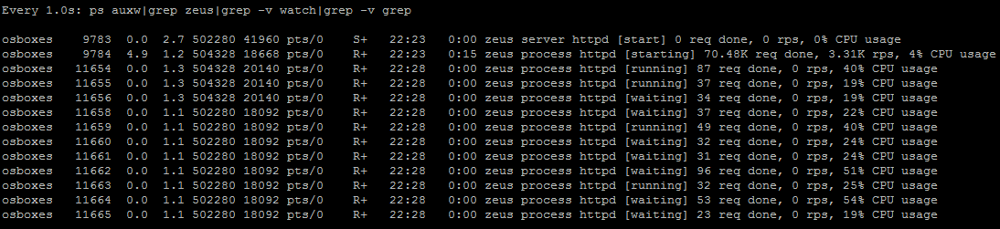
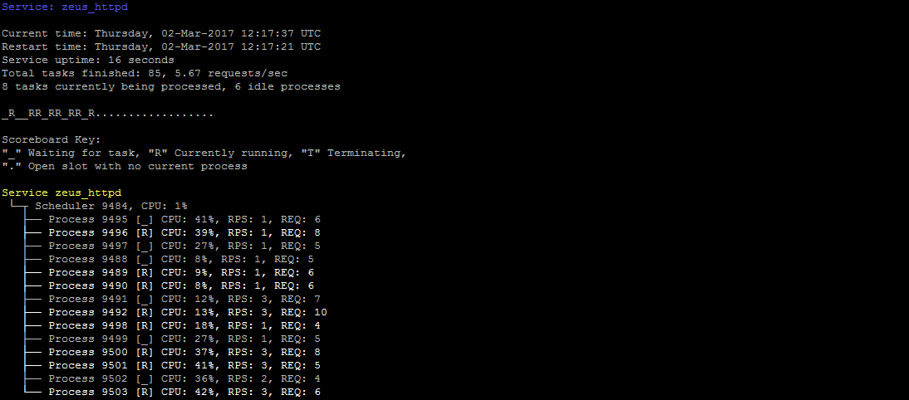
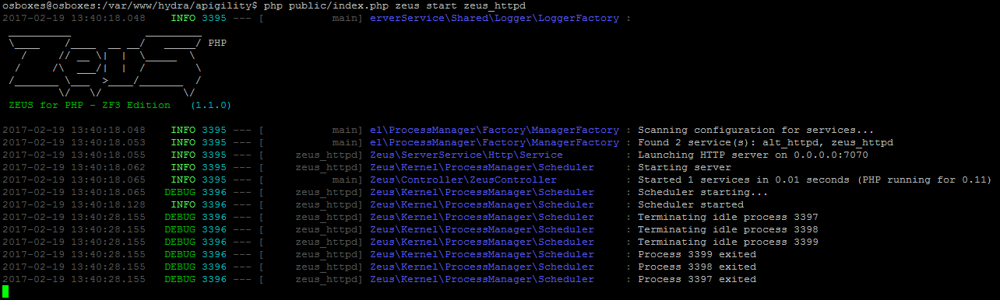

[](https://travis-ci.org/artur-graniszewski/ZEUS-for-PHP) [](https://coveralls.io/github/artur-graniszewski/ZEUS-for-PHP?branch=master) [](https://codeclimate.com/github/artur-graniszewski/ZEUS-for-PHP) [](http://isitmaintained.com/project/artur-graniszewski/zeus-for-php "Percentage of issues still open")

# Introduction


**ZEUS for PHP** is an event-driven, preemptive _Multitasking Runtime Environment_ and _Service Management System_ integrated with Zend Framework 3. It's main purpose is to perform multiple tasks (processes) concurrently.

To guarantee true parallelism and resource isolation ZEUS employs preemptive schedulers and an Inter-Process Communication mechanism to allow its processes to share the data.

***ZEUS for PHP is not a standalone service, in order to use it, it must be installed as a module on-top of any Zend Framework application!.***

It's designed to be compliant with any ZF3 applications such as Apigility or ZendSkeleton. Custom applications must provide index.php file which starts the Zend Framework MVC `Application` class.
# Requirements

## _OS requirements_
- Linux/Unix/BSD platform
- _Windows platform currently not supported_

## _PHP requirements_
- PHP 5.6+, HHVM or PHP 7+ recommended for performance reasons (its up to 4x faster, less memory used)
- Posix module installed and enabled
- Pcntl module installed and enabled
- socket functions enabled for IPC purposes

## _Library requirements_
- Zend Framework 3+ application (with the following modules installed: `zend-mvc`, `zend-mvc-console`, `zend-console`, `zend-log`, `zend-config`)
- ReactPHP library

# Installation

ZEUS for PHP can be installed in two different ways:

## Downloading

### via Composer: 

```
cd zf3-application-directory
composer require zeus-server/zf3-server`
```

### by downloading source code

Source codes can be found in ZIP file under the following URL: https://github.com/artur-graniszewski/ZEUS-for-PHP/archive/master.zip

After downloading, contents of the compressed `ZEUS-for-PHP-master` directory in ZIP file must be unpacked into a ZF3 `zf3-application-directory/module/Zeus` directory.

## Enabling ZEUS module

After installation, ZEUS for PHP must be activated in Zend Framework's `config/modules.config.php` file, like so:

```php
// contents of "zf3-application-directory/config/modules.config.php" file:

return [
    'Zend\\Log',
    'Zend\\Mvc\\Console',
    '...',
    'Zeus' // this line should be added
];
```

This can be achieved either by modifying configuration file in any text editor, or by issuing `sed` command in Application's root directory:
```
sed -i "s/'Zend\\\Log',/'Zend\\\Log','Zeus',/g" config/modules.config.php
```

If ZEUS for PHP is installed correctly, the following terminal command will show ZEUS version and its services in console:

`php public/index.php zeus status`

# Basic usage

## Supported command line options

As of version 1.3.5, the following commands are supported (assuming that Zend Framework's `index.php` application bootstrap file is in the project's `public` directory):

* `public/index.php zeus start` - Starts all ZEUS Server Services
* `public/index.php zeus start <service-name>` - Starts selected Server Service
* `public/index.php zeus list` - Lists all Server Services and their configuration
* `public/index.php zeus list <service-name>` - Shows the configuration of a selected Server Service
* `public/index.php zeus status` - Returns current status of all Server Services
* `public/index.php zeus status <service-name>` - Returns current status of the selected Server Service
* `public/index.php zeus stop` - Stops all ZEUS Server Services
* `public/index.php zeus stop <service-name>` - Stops selected Server Service


## Command line use cases

### Starting ZEUS Web Server

ZEUS Web Service is a built-in HTTP server that demonstrates ZEUS capabilities by hosting Zend Framework applications in pure PHP. 

By default, it's configured to not to start automatically with ZEUS.  To start the service manually, following command must be executed (`index.php` file must be provided by Zend Framework application):

`php public/index.php zeus start zeus_httpd`

In its default configuration, Zend Framework 3 web application can be accessed under http://localhost:7070/ URL (hostname may differ if ZEUS is accessed remotely).

### Tracking Sever Service status

ZEUS for PHP is able to report current status of its Server Services to the user. It achieves this by modifying names of the active processes, which in turn, can be watched real-time in tools like `top`, `htop` or `ps`:



Also, since version 1.2.0, a new set of command line options is available:

`php public/index.php zeus status` 

and 

`php public/index.php zeus start <service name>`

Which will show the user-friendly Server Service status:


# Architecture

## ZEUS is integrated with Zend Framework 3

ZEUS for PHP is highly integrated with _Zend Framework 3_ (ZF3) services such as `ServiceManager` and `EventManager`. Thus, most of ZEUS components and classes are declared as ZF3 services and service factories.
 
Any custom integration with ZEUS should therefore be performed through ZF3 Service Manager and its configuration.

## ZEUS is layered

ZEUS Runtime Environment consists of two layers (user mode and kernel mode):

### Kernel Mode

This is a low level set of features needed to implement any multi-tasking service.

Kernel consists of the following components:

#### Process

In ZEUS, Process is defined as an instance of a PHP application that is being executed. 

The execution of a single process must progress in a sequential fashion, therefore to achieve true concurrency, ZEUS may use _Process Scheduler_ to instantiate more than one such process at the same time.

When a process executes, it passes through different states. In ZEUS, a process can have one of the following five states at a time:


Process can use hardware resources in only two states: waiting and running.

The following table describes each state in details:

| State      | Description                                                                                                                                 |
|------------|---------------------------------------------------------------------------------------------------------------------------------------------|
| STARTED    | An initial state when a process is first created                                                                                            |
| WAITING    | Process is in a waiting state if it needs to wait for a resource, such as waiting for network connection, or some data to become available  |
| RUNNING    | Process sets the state to running just before it starts processing its data                                                                 |
| TERMINATED | When process is terminated by the Process Scheduler, it is moved to the terminated state where it waits to be removed from the Task Pool    |
| EXITED     | This state is set when process finishes its execution, and it waits to be removed from the Task Pool                                        |

#### Process Scheduler

The _Process Scheduler_ is responsible for removal of running processes* from the CPU and the selection of another processes using the Task-Pool strategy. 

It implements the concept of a _Server Service_, which is treated as a group of processes that can be managed as a whole, share same data and be placed under shared restrictions (such as timeouts, resource usage or effective user privileges). As Process Scheduler has the ability to stop and start processes - it decides how many processes are to run as part of a each Service, and the degree of concurrency to be supported at any one time.

Scheduler is responsible for:

- running _Server Services_ in parallel using __preemptive multitasking__
- supporting custom _Multi-Processing Modules_
- managing the number of processes based on a Task-Pool strategy and Scheduler Disciplines
- handling Process lifecycle
- keeping track of and reporting Process state

#### Scheduler Disciplines

In ZEUS, scheduling disciplines are algorithms used for distributing hardware resources (such as CPU time or memory) among Scheduler processes. 

The main purpose of scheduling algorithms is to minimize resource starvation by creating or termination of processes to keep number of active processes within the boundaries specified by Scheduler configuration. 
Some algorithms may focus on termination of processes that were idle for too long, while other may terminate processes based on their actual memory footprint or a number of requests that they already processed.

> Since version 1.3.4, Schedulers can be configured to use custom `\Zeus\Kernel\ProcessManager\Scheduler\Discipline\DisciplineInterface` implementations. 
> **If no such implementation is specified, ZEUS defaults to a built-in _LRU (Least Recently Used) Discipline_.**

#### Multi-Processing Modules

Certain multitasking architectures are incompatible or not efficient enough on different operating systems. To remedy this issue, ZEUS provides a Multi-Processing Module interface between an application and the underlying operating system that is designed to hide these differences by providing a consistent platform on which the application is run. 
 
MPM's primary role is to optimize ZEUS for each platform, by providing platform specific architecture implementation that might be more advantageous than others.

_ZEUS is shipped with a POSIX compliant process implementation which is well suited for most Unix/Linux operating systems._

Custom made MPMs must implement `Zeus\Kernel\ProcessManager\MultiProcessingModule\MultiProcessingModuleInterface`

#### Inter-Process Communication Server

ZEUS provides the mechanisms for multiple processes to communicate with one another and share the data.

By default, ZEUS uses Named Pipes (FIFO) mechanism to communicate with its processes. 

The pluggable _IPC Server_ is shipped with four different IPC implementations (FIFO, APCu Shared Memory, SystemV, Socket) that can be enabled in ZEUS configuration depending on the operating system in use, or a developer preference.

_If selected IPC implementation is not yet supported or is ineffective on a given platform, plugging a different IPC adapter or writing a new one may be necessary._

### User Mode

This is a higher-level ZEUS layer which provides specific services implementation by using the low level Kernel functionality.

It contains the following components:

#### Server Service Manager

In ZEUS _Server Service Manager_ is a component responsible for managing and instantiating ZEUS Server Services*. 

It allows to:

- view a list of installed Server Services along with their names, description and configuration
- start and stop a single Server Service
- auto-start multiple Server Services based depending on their configuration

_\* In ZEUS, Server Service is a set of one or more PHP processes running concurrently in the background. It's code must conform to the interface rules of the Server Service Manager._

To launch all `auto_start` enabled _Server Services_, the following command must be used in a user terminal:

`php public/index.php zeus start`

#### Logger

ZEUS provides a set of components able to record either events that occur in its core services, or messages between different processes.

By default ZEUS log entries are written to `STDOUT` (standard output stream) and therefore, visible as a user-friendly text in the user terminal.



Custom loggers and output streams can be specified in ZEUS configuration.

#### Web Server Service

ZEUS Web Server is a simple _Server Service_ HTTP/1.1 daemon responsible for hosting _Zend Framework 3_ web applications in a multi-processing environment.

_When serving Zend Framework 3 PHP applications - it's able to outperform other, standalone servers such as Apache HTTPD or NGINX by a margin of up to 30%._

In case of acting as as server for static content such as images or binary files, ZEUS Web Server can be up to 50% slower than the Apache counterpart (but still able to handle more than **16000** static file requests per second on a 3.2Ghz _Intel Core i7_ processor).

> **Please note:** 
> ZEUS Web Service is not a full-featured web server. In it's current state, it's meant to be used as a development aid or a simple, yet efficient intranet web service without a direct access to a public network.
>
> If required, for increased security and performance, this server can be launched behind a forward proxy such as Varnish, NGINX Proxy or Squid.

This service is not enabled by default, but can be configured to auto-start with ZEUS if needed.

To start the service manually, following command must be executed:

`php public/index.php zeus start zeus_httpd`

#### Memcache Server Service

ZEUS Memcache Server is a native PHP implementation of the Memcached distributed memory object caching system.

This service is highly integrated with Zend Framework caching mechanism, and allows to use any zend-cache compatible adapter (be it `APC`, `Filesystem`, `Memory` or custom ones) as distributed cache through the memcached protocol.

> **Please note:** 
> Clients of memcached must communicate with ZEUS Memcache Server Service through TCP connections using the memcached text protocol. 
>
> As of version 1.4.0, neither UDP interface nor memcached binary protocol are available. 

To run this service, the following requirements must be met:

- a `zendframework/zend-cache` component must be installed and enabled in Zend Application
- when using APC or APCu cache adapters, appropriate PHP extension must be installed and configured: `apc.enabled` and `apc.cli_enable` parameters in `php.ini` file must be set to `1`, and depending on the usage characteristics, `apc.shm_size` parameter should be set to a higher number such as `256M`.
- when using Filesystem based cache adapters, SSD or RAMDISK storage is highly recommended for performance reasons.

**Service will refuse to start if the cache preconditions are not met.**

This service is not enabled by default, but can be configured to auto-start with ZEUS if needed.

To start the service manually, following command must be executed:

`php public/index.php zeus start zeus_memcache`

*In its default configuration, ZEUS Memcache Server uses APCu adapter that is shipped with `zend-cache` component*. This adapter can be replaced anytime by modifying certain service configuration (see "ZEUS Configuration" section for details).


## ZEUS is Event Driven

ZEUS for PHP incorporates and utilizes a custom Zend event implementation - `Zeus\Kernel\ProcessManager\SchedulerEvent` throughout its entire life-cycle process.

Access to this event is public and can used to fully customize ZEUS for PHP behaviour.

_By default, the following ZEUS event flow is in effect (events are colored yellow and light-blue):_


Both Scheduler and Process instances are isolated from each other and can share their data only through the _Inter-Process Communication_ messages. 
The same applies to ZEUS events: Scheduler events (yellow) can't be intercepted by the Process instances, as well as Process events (light-blue) by a Scheduler instance.


## ZEUS is Pluggable

As of version 1.4.1 of ZEUS for PHP, Schedulers behaviour can be extended through its configuration with custom plugins implementing the `\Zend\EventManager\ListenerAggregateInterface` interface.

Custom plugins can be specified in Schedulers configuration like so (see `plugins` JSON node):

```php
// contents of "zf3-application-directory/config/some-config.config.php" file:

use Zeus\Kernel\ProcessManager\MultiProcessingModule\PosixProcess;
use Zeus\Kernel\ProcessManager\Scheduler\Discipline\LruDiscipline;

return [
    'zeus_process_manager' => [
        'schedulers' => [
            'scheduler_1' => [
                'scheduler_name' => 'sample_scheduler',
                'scheduler_discipline' => LruDiscipline::class,
                'multiprocessing_module' => PosixProcess::class,
                'max_processes' => 32,
                'max_process_tasks' => 100,
                'min_spare_processes' => 3,
                'max_spare_processes' => 5,
                'start_processes' => 8,
                'enable_process_cache' => true,
                'plugins => [
                    \Zeus\Kernel\ProcessManager\Plugin\ProcessTitle::class, // by class name
                    
                    'SomeZFServiceManagerServiceName`, // by name of ZF Service instantiated by its ServiceManager,
                    
                    \Zeus\Kernel\ProcessManager\Plugin\DropPrivileges::class => [ // by class name in array key and constructor params in array value
                        'user' => 'www-data',
                        'group' => 'www-data',
                    ], 
                    
                    $someObject // directly as an object instance
                ]
            ]
        ]
    ]
];
```

Out of the box, ZEUS comes equipped with two Scheduler plugins: `\Zeus\Kernel\ProcessManager\Plugin\ProcessTitle` and `\Zeus\Kernel\ProcessManager\Plugin\DropPrivileges`.

ProcessTitle plugin does not take any options, its main purpose is to alter process names in terminal to show current operations performed by ZEUS.

DropPrivileges plugin requires two options to be set (user and group, see example above). Its main purpose is to switch real user of the process from root to an unprivileged account (for security purposes).

# ZEUS configuration

## Kernel mode

### Scheduler

Multiple _Process Schedulers_ can be configured in a regular Zend Framework 3 configuration file, like so:

```php
// contents of "zf3-application-directory/config/some-config.config.php" file:

use Zeus\Kernel\ProcessManager\MultiProcessingModule\PosixProcess;
use Zeus\Kernel\ProcessManager\Scheduler\Discipline\LruDiscipline;

return [
    'zeus_process_manager' => [
        'schedulers' => [
            'scheduler_1' => [
                'scheduler_name' => 'sample_scheduler',
                'scheduler_discipline' => LruDiscipline::class, // choice available since version 1.3.4
                'multiprocessing_module' => PosixProcess::class,
                'max_processes' => 32,
                'max_process_tasks' => 100,
                'min_spare_processes' => 3,
                'max_spare_processes' => 5,
                'start_processes' => 8,
                'enable_process_cache' => true
            ]
        ]
    ]
];
```

The table below describes the configuration parameters:

| Parameter              | Required | Description                                                                           |
|------------------------|:--------:|---------------------------------------------------------------------------------------|
| scheduler_name         | yes      | Unique name of the scheduler configuration                                            |
| scheduler_discipline   | no       | Zend Framework service providing Scheduler's process management strategy              |
| multiprocessing_module | yes      | Specifies a `MultiProcessingModuleInterface` implementation to be used in a Scheduler |
| start_processes        | yes      | Specifies the number of processes that will initially launch with each Server Service |
| max_processes          | yes      | Maximum number of running/waiting processes of each Server Service                    |
| max_process_tasks      | yes      | Maximum number of tasks performed by each process before its exit                     |
| enable_process_cache   | yes      | Controls whether pre-forking mechanism should be used for increased performance       |
| min_spare_processes    | yes      | Minimal number of processes in a waiting state when process cache is enabled          |
| max_spare_processes    | yes      | Maximum number of waiting processes when the process cache is enabled                 |

## User mode

### Server Service Manager

Multiple _Server Services_ can be configured in a regular Zend Framework 3 configuration file, like so:

```php
// contents of "zf3-application-directory/config/some-config.config.php" file:

use Zeus\ServerService\Shared\Logger\LoggerInterface;

return [
    'zeus_process_manager' => [
        'services' => [
            'service_name_1' => [
                'auto_start' => false,
                'service_name' => 'some_service_name',
                'scheduler_name' => 'sample_scheduler',
                'service_adapter' => 'CustomZendFrameworkServiceName',
                'logger_adapter' => LoggerInterface::class
                'service_settings' => [
                    'service_custom_data' => 'value'
                ]
            ]
        ]
    ]
];
```

The table below describes the configuration parameters:

| Parameter        | Required | Description                                                                                 |
|------------------|:--------:|---------------------------------------------------------------------------------------------|
| service_name     | yes      | Unique name of this _Server Service_                                                        |
| scheduler_name   | yes      | Specifies which Scheduler configuration should be used to run this service                  |
| service_adapter  | yes      | Specifies which `Zeus\ServerService\ServiceInterface` implementation should be launched     |
| logger_adapter   | no       | Allows to use a custom `Zend\Log\LoggerInterface` implementation for service logging        |
| auto_start       | yes      | Instructs _Server Service Manager_ to run this service automatically on ZEUS startup        |
| service_settings | no       | Allows to pass a set of custom parameters to the _Server Service_ factory                   |

If no `logger_adapter` is specified, ZEUS injects its own _Logger_ instance to the service.

### Logger

Different output streams, as well as custom `Logger` adapters can be provided through a Zend Framework `ServiceManager` and its configuration files, like so:

```php
// contents of "zf3-application-directory/config/some-config.config.php" file:

return [
    'zeus_process_manager' => [
        'logger' => [
            'reporting_level' => \Zend\Log\Logger::DEBUG,
            'output' => 'php://stdout',
            'show_banner' => true,
            'logger_adapter' => 'CustomLoggerServiceName'
        ]
    ]
];
```

The table below describes the configuration parameters:

| Parameter        | Required | Description                                                                                 |
|------------------|:--------:|---------------------------------------------------------------------------------------------|
| reporting_level  | no       | Minimum severity required to log the event (see `Zend\Log\Logger::*`, default: `DEBUG`)     |
| output           | no       | Specifies where to write the logs, used only by default ZEUS logger, default: `STDOUT`      |
| show_banner      | no       | Controls whether default ZEUS logger should render its banner on startup or not             |
| logger_adapter   | no       | Allows to use a custom `Zend\Log\LoggerInterface` implementation for service logging        |

### Web Server

Different listening port or address can be provided through a Zend Framework `ServiceManager` and its configuration files, like so:

```php
// contents of "zf3-application-directory/config/some-config.config.php" file:

use Zeus\Kernel\ProcessManager\MultiProcessingModule\PosixProcess;
use Zeus\Kernel\ProcessManager\Scheduler\Discipline\LruDiscipline;

return [
    'zeus_process_manager' => [
        'schedulers' => [
            'custom_web_scheduler_1' => [
                'scheduler_name' => 'custom_web_scheduler',
                'multiprocessing_module' => PosixProcess::class,
                'scheduler_discipline' => LruDiscipline::class,
                'max_processes' => 32,
                'max_process_tasks' => 100,
                'min_spare_processes' => 3,
                'max_spare_processes' => 5,
                'start_processes' => 8,
                'enable_process_cache' => true,
            ]
        ],
        'services' => [
            'custom_httpd_1' => [
                'auto_start' => true,
                'service_name' => 'custom_httpd',
                'scheduler_name' => 'custom_web_scheduler',
                'service_adapter' => \Zeus\ServerService\Http\Service::class,
                'service_settings' => [
                    'listen_port' => 80,
                    'listen_address' => '0.0.0.0',
                    'blocked_file_types' => [
                        'php',
                        'phtml'
                    ]
                ],
                //'logger_adapter' => LoggerInterface::class // optional
            ]
        ],
    ]
];
```

The table below describes the `service_settings` configuration parameters:

| Parameter          | Required | Description                                                                                 |
|--------------------|:--------:|---------------------------------------------------------------------------------------------|
| listen_port        | yes      | The service listen port, 80 is a default HTTP port                                          |
| listen_address     | yes      | The service listen address, use 0.0.0.0 to listen on all available network addresses        |
| blocked_file_types | yes      | A blacklist of file extensions that should not be served as plain text by ZEUS Web Server   |
| logger_adapter     | yes      | Custom logger service used for HTTP request logging (instantiated by ZF `ServiceManager` )  |

To start such a service, the following command must be issued in a terminal:

`php public/index.php zeus start custom_httpd`

### Memcache Server

Different cache adapters may be provided through a Zend Framework `Zend\Cache\Service\StorageCacheAbstractServiceFactory` and its configuration files, like so:

```php
// contents of "zf3-application-directory/config/some-config.config.php" file:

return [
    'caches' => [
        'custom_internal_cache' => [
            'adapter' => [
                'name'    => 'filesystem',
                'options' => [
                    'cache_dir' => '/tmp/'
                ]
            ],
        ],
        'custom_user_cache' => [
            'adapter' => [
                'name'    => 'apcu',
                'options' => [
                ]
            ],
        ]
    ],
    'zeus_process_manager' => [
        'services' => [
            'custom_memcache' => [
                'auto_start' => false,
                'service_name' => 'custom_memcache',
                'scheduler_name' => 'zeus_web_scheduler',
                'service_adapter' => \Zeus\ServerService\Memcache\Service::class,
                'service_settings' => [
                    'listen_port' => 11211,
                    'listen_address' => '0.0.0.0',
                    'server_cache' => 'custom_internal_cache',
                    'client_cache' => 'custom_user_cache',
                ],
            ]
        ]
    ]
];
```

The table below describes the `service_settings` configuration parameters:

| Parameter        | Required | Description                                                                                 |
|------------------|:--------:|---------------------------------------------------------------------------------------------|
| listen_port      | yes      | The service listen port, 11211 is a default memcached port                                  |
| listen_address   | yes      | The service listen address, use 0.0.0.0 to listen on all available network addresses        |
| server_cache     | yes      | Name of the `zend-cache` instance. This cache is used for server needs, such as statistics  |
| client_cache     | yes      | Name of the `zend-cache` instance. This cache is used to store client cache entries         |

Please check Zend Framework `zend-cache` [documentation](https://framework.zend.com/manual/2.3/en/modules/zend.cache.storage.adapter.html) to read how to configure or implement your own cache instances.

To start such a service, the following command must be issued in a terminal:

`php public/index.php zeus start custom_memcache`

# ZEUS Customization

## Creating a custom Server Service

Every _Server Service_ needs to implement `Zeus\ServerService\ServiceInterface`. 

To speed up the development process, ZEUS is shipped with the following classes and factories that can be used as a base for new services:

- `Zeus\ServerService\Shared\AbstractServerService` - a very crude boilerplate for new _Server Services_
- `Zeus\ServerService\Shared\Factory\AbstractServerServiceFactory` - an abstract Zend Framework factory that creates _Server Services_ if they don't use their own factories. 

Each service must be listed in the `services` section of `zeus_process_manager` configuration entry and point to a valid _Scheduler_ configuration (or specify its own implementation in ZEUS `schedulers` section), like so:
 
```php
// contents of "zf3-application-directory/config/some-config.config.php" file:

use Zeus\ServerService\Shared\Logger\LoggerInterface;
use Zeus\Kernel\ProcessManager\MultiProcessingModule\PosixProcess;

return [
    'zeus_process_manager' => [
        'services' => [
            'service_name_1' => [
                'auto_start' => false,
                'service_name' => 'some_service_name',
                'scheduler_name' => 'sample_scheduler',
                'service_adapter' => 'CustomZendFrameworkServiceName',
                'logger_adapter' => LoggerInterface::class
                'service_settings' => [
                    'service_custom_data' => 'value'
                ]
            ]
        ],
        'schedulers' => [
            'scheduler_1' => [
                'scheduler_name' => 'sample_scheduler',
                'multiprocessing_module' => PosixProcess::class,
                'max_processes' => 32,
                'max_process_tasks' => 100,
                'min_spare_processes' => 3,
                'max_spare_processes' => 5,
                'start_processes' => 8,
                'enable_process_cache' => true
            ]
        ]
    ]
];
```

The above configuration parameters have been described in the __Process Scheduler__ and __Server Service Manager__ documentation chapters.

# Road map

## Short-term

### Documentation
- Improvement of ZEUS documentation
- Tutorials and How-to's

### Web Server
- Code refactor and HTTP performance improvements
- Performance improvements in Application dispatcher when handling Zend Framework applications
- Removing dependency on ReactPHP
- More configuration options

### Inter-Process Communication
- Various code improvements in IPC adapters
- Introduction of IPC strategy that will choose the most efficient IPC implementation depending on a platform.

### Server Service Manager
- Additional `EventManager` events covering full application lifecycle
- More advanced Service reporting and control tools for terminal and remote use
- Add a plugin that drops user privileges on start of the _Server Service_
- Advanced, `systemd`-like handling of Server Service failures or remote shutdowns

### Process Manager
- Configurable, more robust scheduling strategies (like terminating processes that handled the largest amount of request, etc)*[]: 

### Tests
- More automatic tests

# Long-Term

### POSIX Threads
- Adding support for threads in PHP

### Connection pooling
- NGINX like connection pooling in ZEUS Web Server (performance improvement)
- Abstract Server Service classes that will speed up the development of other types of connection pooling services
- Database connection pooling (?)

### FastCGI/FPM
- Add possibility to execute Server Services in isolated PHP instances
- Allow ZEUS Web Server to host FastCGI/FPM applications

### Experimental support for Windows platform

### Other services
- Redis Server Service implementation PoC
- More features introduced to ZEUS Web Server